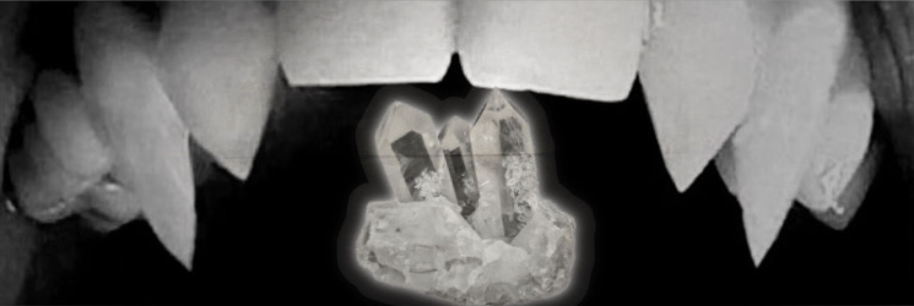

  

    

  

  # Crystal Client
  **Crystal Client is a client that includes many features, one being a usefull chatbox better than any you have ever seen!**
  
   

  [⬇️ **Download Crystal Client (Windows)**](https://github.com/DevSapph1r3/Crystal-Client/releases/tag/V1.0.0)

   

  

---

## ✨ Features
- [List Features]
---

## 💻 Platform Support

| Platform | Status | Notes |
|---------|--------|-------|
| **Windows (.exe)** | ✅ **Available Now** | Download from Releases |
| **macOS (.app / .dmg)** | ⏳ Coming Soon |  Apple Silicon + Intel |
| **Linux (.AppImage / .deb)** | ⏳ Coming Soon | Ubuntu + Arch |
| **Android (.apk)** | ⏳ Coming Soon | Quest + Iphone |

---

## 📥 Installation
1. Download the latest `.exe` from the **Releases** page.
2. Run the application — no installer needed.
3. In VRChat → **Settings → OSC**, ensure OSC is **Enabled**.
4. Configure features in the application UI.

---

## 📚 Documentation (Coming Soon)
- Config Guide
- Troubleshooting
- OSC Behavior Reference

---

## ❓ FAQ

**Q: My heart rate isn't showing.**  
→ Ensure Pulsoid tokens are entered correctly & API access is granted.

**Q: Crystal Chatbox doesn’t appear in VRChat.**  
→ Make sure OSC is enabled in VRChat settings and restart VRChat after enabling.

**Q: Does this get me banned from VRChat?**  
→ No. Crystal Client sends standard, allowed OSC messages — nothing exploitative.

---

## 🆘 Support

Need help or want to submit feedback?

- Join the Discord: [DC Server Link]

---

## 👤 Credits
Developed by Ozrvv on github, 
Thanks to friends + testers for feature inspiration and feedback.

---

## ⚖️ Legal Notice
Crystal Client is source-available and **free for personal use.**  
Commercial redistribution or resale is not allowed.

See: `LICENSE.md`, `TERMS.md`, and `PRIVACY.md`

